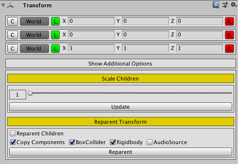

# Custom-Transform-Editor
This is an editor extension for in-build **Transform** componenet in Unity Engine. 

Features:  
* **Copy/Paste** transform values.
* Edit transform values in **Local/World** space.
* **Lock** xyz components and modify them simultaneously.
* **Reset** transform values to default value individually.
* **Scale** children by maintaining relative position to parent.
* **Reparent** to an empty gameobject and copy all additional components to parent.

## Under Development
This repo is still under development.

# License
This project is licensed under [MIT License](https://github.com/Wariar/Extensions/blob/master/LICENSE).
